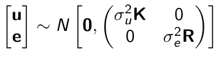
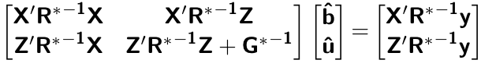
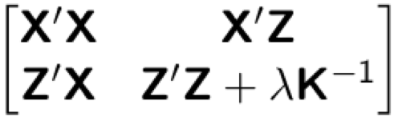
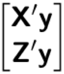
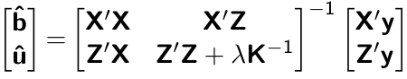
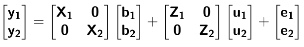
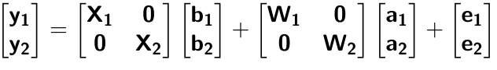
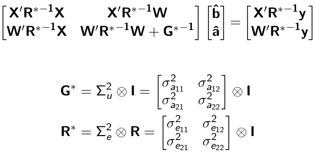

```{r setup, include=FALSE}
options(htmltools.dir.version = FALSE)
```


# Single trait GBLUP model 
$$\mathbf{y_{1} = X_{1}b_{1} + Z_{1}u_{1} + e_{1}}$$
<div align="center">

</div>

- $\mathbf{K}$: genomic relationship matrix

- $\mathbf{R}$: residual relationship matrix 

- $\sigma^2_{u_1}$: genomic variance

- $\sigma^2_{e_1}$: residual variance


---
# Single trait GBLUP model 
The corresponding mixed model equations (MME) are


- $\mathbf{G}^* = \sigma^2_u \mathbf{K}$

- $\mathbf{R}^* = \sigma^2_e \mathbf{R}$

If we multipy $\mathbf{R}^* = \sigma^2_e\mathbf{I}$ to the both sides


where $\lambda = \sigma^2_e / \sigma^2_u$

- MME produces BLUE (E-BLUE) and BLUP (E-BLUP) simultaneously 


---
# Decoding single trait MME
| ID | Phe  | Env           | Gen  | 
| ------------- |:-------------:| -----:| -----:|
|1| 47      | E1 | G1 |
|2| 51      |  E1     |   G2 |
|3| 46 | E1     |    G3 |
|4| 58 | E1     |    G4 |
|5| 52 | E2     |    G1 |
|6| 46 | E2     |    G2 |
|7| 52 | E2     |    G3 |
|8| 54 | E2     |    G4 |
|9| 53 | E3     |    G1 |
|10| 48 | E3     |    G2 |
|11| 58 | E3     |    G3 |
|12| 52 | E3    |    G4 |


- Credit: [Alencar Xavier @Corteva](http://alenxav.wixsite.com/home)

---
# What is X?
| ID | EnvE1  | EnvE2           | EnvE3  | 
| ------------- |:-------------:| -----:| -----:|
|1| 1     | 0 | 0 |
|2| 1      | 0     |   0 |
|3| 1 | 0     |    0 |
|4| 1 | 0     |    0 |
|5| 0 | 1     |    0 |
|6| 0 | 1     |    0 |
|7| 0 | 1     |    0 |
|8| 0 | 1     |    0 |
|9| 0 | 0     |    1 |
|10| 0 | 0     |    1 |
|11| 0 | 0     |    1 |
|12| 0 | 0    |    1 |

- $\mathbf{X}$ is the 12 x 3 matrix

---
# What is Z?
| ID | GenG1  | GenG2           | GenG3  | GenG4 | 
| ------------- |:-------------:| -----:| -----:| -----:|
|1| 1     | 0 | 0 |0 |
|2| 0      | 1    |   0 |0 |
|3| 0 | 0     |    1 |0 |
|4| 0 | 0     |    0 |1 |
|5| 1 | 0     |    0 |0 |
|6| 0 | 1     |    0 |0 |
|7| 0 | 0     |    1 |0 |
|8| 0 | 0     |    0 |1 |
|9| 1 | 0     |    0 |0 |
|10| 0 | 1     |    0 |0 |
|11| 0 | 0     |    1 |0 |
|12| 0 | 0    |    0 |1 |

- $\mathbf{Z}$ is the 12 x 4 matrix


---
# What is X'X?

- $\mathbf{X'}$ is the 3 x 12 matrix

- $\mathbf{X}$ is the 12 x 3 matrix

- $\mathbf{X'X}$ is the 3 x 3 matrix

|  | EnvE1  | EnvE2           | EnvE3  | 
| ------------- |:-------------:| -----:| -----:|
|EnvE1| 4     | 0 | 0 |
|EnvE2| 0      | 4     |   0 |
|EnvE3| 0 | 0     |    4 |

--

- $\mathbf{X'X}$ is the 3 x 3 diagonal matrix counting the number of phenotypes observed in each environment 


---
# What is X'Z?

- $\mathbf{X'}$ is the 3 x 12 matrix

- $\mathbf{Z}$ is the 12 x 4 matrix

- $\mathbf{X'Z}$ is the 3 x 4 matrix

|  | GenG1  | GenG2           | GenG3  | GenG4 | 
| ------------- |:-------------:| -----:| -----:| -----:|
|EnvE1| 1     | 1 | 1 |1 |
|EnvE2| 1      | 1    |   1 |1 |
|EnvE3| 1 | 1     |    1 |1 |

--

- $\mathbf{X'Z}$ is the 3 x 4 matrix counting the number of each genotype in each environment 


---
# What is Z'X?
- $\mathbf{Z'}$ is the 4 x 12 matrix

- $\mathbf{X}$ is the 12 x 3 matrix

- $\mathbf{X'Z}$ is the 4 x 3 matrix

|  | EnvE1  | EnvE2           | EnvE3  | 
| ------------- |:-------------:| -----:| -----:|
|GenG1| 1     | 1 | 1 |
|GenG2| 1      | 1     |   1 |
|GenG3| 1 | 1     |    1 |
|GenG4| 1 | 1     |    1 |

- $\mathbf{Z'X}$ is the 4 x 3 matrix counting the number of each genotype in each environment 


---
# What is Z'Z?
- $\mathbf{Z'}$ is the 4 x 12 matrix

- $\mathbf{Z}$ is the 4 x 12 matrix

- $\mathbf{Z'Z}$ is the 4 x 4 matrix

|  | GenG1  | GenG2           | GenG3  | GenG4 | 
| ------------- |:-------------:| -----:| -----:| -----:|
|GenG1| 3     | 0 | 0 |0 |
|GenG2| 0      | 3   |   0 |0 |
|GenG3| 0 | 0     |    3 |0 |
|GenG4| 0 |0     |    0 |3|

- $\mathbf{Z'Z}$ is the 4 x 4 diagonal matrix counting the number of phenotypes observed for each genotype 


---
# What is Z'Z + $\lambda \mathbf{K}^{-1}$?
- $\mathbf{Z'}$ is the 4 x 12 matrix

- $\mathbf{Z}$ is the 4 x 12 matrix

- $\mathbf{Z'Z}$ is the 4 x 4 matrix

--

- assume $\mathbf{K} = \mathbf{I}$ (no relationship)

- $\lambda = \sigma^2_e / \sigma^2_u = 1.64/9.56 = 0.17$

--

|  | GenG1  | GenG2           | GenG3  | GenG4 | 
| ------------- |:-------------:| -----:| -----:| -----:|
|GenG1| 3.17     | 0 | 0 |0 |
|GenG2| 0      | 3.17   |   0 |0 |
|GenG3| 0 | 0     |    3.17 |0 |
|GenG4| 0 |0     |    0 |3.17|

- $\mathbf{Z'Z} + \lambda \mathbf{I}$ is the 4 x 4 diagonal matrix counting the number of phenotypes observed for each genotype + $\lambda$ value in the diagonal elements

---
# What is the left hand side of MME?
<div align="center">

</div>


|  | EnvE1  | EnvE2           | EnvE3  | GenG1  | GenG2  | GenG3  | GenG4  | 
| ------------- |:-------------:| -----:| -----:|-----:| -----:|-----:| -----:|
|EnvE1| 4     | 0 | 0 |1 |1 |1 |1 |
|EnvE2| 0     | 4 | 0 |1 |1 |1 |1 |
|EnvE3| 0     | 0 | 4 |1 |1 |1 |1 |
|GenG1| 1      | 1     |   1 |3.17 |0 |0 |0 |
|GenG2| 1      | 1     |   1 |0 |3.17 |0 |0 |
|GenG3| 1 | 1     |    1 |0 |0 |3.17 |0 |
|GenG4| 1 | 1     |    1 |0 |0 |0 |3.17 |


---
# What is X'y?
- $\mathbf{X'}$ is the 3 x 12 matrix

- $\mathbf{y}$ is the 12 x 1 matrix

- $\mathbf{X'y}$ is the 3 x 1 matrix

|  |   | 
| ------------- |:-------------:| 
|EnvE1| 202     |
|EnvE2| 204      | 
|EnvE3| 211 | 

--

- $\mathbf{X'y}$ is the 3 x1 matrix counting the sum of phenotypes in each environment

---
# What is Z'y?
- $\mathbf{Z'}$ is the 4 x 12 matrix

- $\mathbf{y}$ is the 12 x 1 matrix

- $\mathbf{Z'y}$ is the 4 x 1 matrix

|  |   | 
| ------------- |:-------------:| 
|GenG1| 152     |
|GenG2| 145      | 
|GenG3| 156 | 
|GenG4| 164 | 

--

- $\mathbf{Z'y}$ is the 4 x1 matrix counting the sum of phenotypes for each genotype


---
# What is the right hand side of MME?
<div align="center">

</div>

|  |   | 
| ------------- |:-------------:| 
|EnvE1| 202     |
|EnvE2| 204      | 
|EnvE3| 211 | 
|GenG1| 152     |
|GenG2| 145      | 
|GenG3| 156 | 
|GenG4| 164 | 


---
# Solutions


|  |   | 
| ------------- |:-------------:| 
|EnvE1| 50.50     |
|EnvE2| 51.00      | 
|EnvE3| 52.75 | 
|GenG1| -0.71     |
|GenG2| -2.92      | 
|GenG3| 0.55 | 
|GenG4| 3.08 | 

- These are BLUE and BLUP of environments and genotypes, respectively


---
# The role of lambda

BLUE = sum / $n_{x}$ = the sum of phenotypes in each environment / the number of phenotypes observed in each environment 

- BLUE is simply computing averages 

BLUP = sum / $n_{z} + \lambda$ = the sum of phenotypes for each genotype / the number of phenotypes observed for each genotype + $\lambda$

- BLUP is shrinked toward zero (proportional to $\lambda$)

--

Note that $\lambda = \frac{1-h^2}{h^2}$
- More observations $\rightarrow$ less shrinkage 

- Higher heritability $\rightarrow$ less shrinkage 


---
# When relationships are known
Suppose $\mathbf{K}$ is given by 

|  | GenG1  | GenG2           | GenG3  | GenG4 | 
| ------------- |:-------------:| -----:| -----:| -----:|
|GenG1| 1.00     | 0.64 | 0.23 |0.48 |
|GenG2| 0.64      | 1.00   |   0.33 |0.67 |
|GenG3| 0.23 | 0.33     |    1.00 |0.31 |
|GenG4| 0.48 |0.67     |    0.31 |1.00|

--

Then $\lambda \mathbf{K}^{-1}$ is

|  | GenG1  | GenG2           | GenG3  | GenG4 | 
| ------------- |:-------------:| -----:| -----:| -----:|
|GenG1| 0.15     | -0.09 | 0.00 |-0.01 |
|GenG2| -0.09      | 0.22   |   -0.02 |-0.10 |
|GenG3| 0.00 | -0.02     |    0.10 |-0.02 |
|GenG4| -0.01 |-0.10     |    -0.02 |0.17|

- $\lambda = \sigma^2_e / \sigma^2_u = 1.64/17.70 = 0.09$


---
# What is the left hand side of MME?
<div align="center">

</div>


|  | EnvE1  | EnvE2           | EnvE3  | GenG1  | GenG2  | GenG3  | GenG4  | 
| ------------- |:-------------:| -----:| -----:|-----:| -----:|-----:| -----:|
|EnvE1| 4     | 0 | 0 |1 |1 |1 |1 |
|EnvE2| 0     | 4 | 0 |1 |1 |1 |1 |
|EnvE3| 0     | 0 | 4 |1 |1 |1 |1 |
|GenG1| 1      | 1     |   1 |3.15 |-0.09 |0.00 |-0.01 |
|GenG2| 1      | 1     |   1 |-0.09 |3.22 |-0.02 |-0.10 |
|GenG3| 1 | 1     |    1 |0.00 |-0.02 |3.10 |-0.02 |
|GenG4| 1 | 1     |    1 |-0.01 |-0.10 |-0.02 |3.17 |


---
# When there are missing phenotypes
| ID | Phe  | Env           | Gen  | 
| ------------- |:-------------:| -----:| -----:|
|1| 47      | E1 | G1 |
|2| 51      |  E1     |   G2 |
|3| NA | E1     |    G3 |
|4| 58 | E1     |    G4 |
|5| 52 | E2     |    G1 |
|6| 46 | E2     |    G2 |
|7| 52 | E2     |    G3 |
|8| NA | E2     |    G4 |
|9| 53 | E3     |    G1 |
|10| 48 | E3     |    G2 |
|11| 58 | E3     |    G3 |
|12| 52 | E3    |    G4 |


---
# What is X?

| ID | EnvE1  | EnvE2           | EnvE3  | 
| ------------- |:-------------:| -----:| -----:|
|1| 1     | 0 | 0 |
|2| 1      | 0     |   0 |
|4| 1 | 0     |    0 |
|5| 0 | 1     |    0 |
|6| 0 | 1     |    0 |
|7| 0 | 1     |    0 |
|9| 0 | 0     |    1 |
|10| 0 | 0     |    1 |
|11| 0 | 0     |    1 |
|12| 0 | 0    |    1 |

- Remove missing rows

- $\mathbf{X}$ is the 10 x 3 matrix


---
# What is Z?

| ID | GenG1  | GenG2           | GenG3  | GenG4 | 
| ------------- |:-------------:| -----:| -----:| -----:|
|1| 1     | 0 | 0 |0 |
|2| 0      | 1    |   0 |0 |
|4| 0 | 0     |    0 |1 |
|5| 1 | 0     |    0 |0 |
|6| 0 | 1     |    0 |0 |
|7| 0 | 0     |    1 |0 |
|9| 1 | 0     |    0 |0 |
|10| 0 | 1     |    0 |0 |
|11| 0 | 0     |    1 |0 |
|12| 0 | 0    |    0 |1 |

- Remove missing rows

- $\mathbf{Z}$ is the 10 x 4 matrix


---
# What is X'X?

- $\mathbf{X'}$ is the 3 x 10 matrix

- $\mathbf{X}$ is the 10 x 3 matrix

- $\mathbf{X'X}$ is the 3 x 3 matrix

|  | EnvE1  | EnvE2           | EnvE3  | 
| ------------- |:-------------:| -----:| -----:|
|EnvE1| 3     | 0 | 0 |
|EnvE2| 0      | 3     |   0 |
|EnvE3| 0 | 0     |    4 |

--

- $\mathbf{X'X}$ is the 3 x 3 diagonal matrix counting the number of phenotypes observed in each environment 


---
# What is X'Z?

- $\mathbf{X'}$ is the 3 x 10 matrix

- $\mathbf{Z}$ is the 10 x 4 matrix

- $\mathbf{X'Z}$ is the 3 x 4 matrix

|  | GenG1  | GenG2           | GenG3  | GenG4 | 
| ------------- |:-------------:| -----:| -----:| -----:|
|EnvE1| 1     | 1 | 0 |1 |
|EnvE2| 1      | 1    |   1 |0 |
|EnvE3| 1 | 1     |    1 |1 |

--

- $\mathbf{X'Z}$ is the 3 x 4 matrix counting the number of each genotype in each environment 


---
# What is Z'X?
- $\mathbf{Z'}$ is the 4 x 10 matrix

- $\mathbf{X}$ is the 10 x 3 matrix

- $\mathbf{X'Z}$ is the 4 x 3 matrix

|  | EnvE1  | EnvE2           | EnvE3  | 
| ------------- |:-------------:| -----:| -----:|
|GenG1| 1     | 1 | 1 |
|GenG2| 1      | 1     |   1 |
|GenG3| 0 | 1     |    1 |
|GenG4| 1 | 0     |    1 |

- $\mathbf{Z'X}$ is the 4 x 3 matrix counting the number of each genotype in each environment 


---
# What is Z'Z?
- $\mathbf{Z'}$ is the 4 x 10 matrix

- $\mathbf{Z}$ is the 4 x 10 matrix

- $\mathbf{Z'Z}$ is the 4 x 4 matrix

|  | GenG1  | GenG2           | GenG3  | GenG4 | 
| ------------- |:-------------:| -----:| -----:| -----:|
|GenG1| 3     | 0 | 0 |0 |
|GenG2| 0      | 3   |   0 |0 |
|GenG3| 0 | 0     |    2 |0 |
|GenG4| 0 |0     |    0 |2|

- $\mathbf{Z'Z}$ is the 4 x 4 diagonal matrix counting the number of phenotypes observed for each genotype 


---
# What is the left hand side of MME?
<div align="center">

</div>


|  | EnvE1  | EnvE2           | EnvE3  | GenG1  | GenG2  | GenG3  | GenG4  | 
| ------------- |:-------------:| -----:| -----:|-----:| -----:|-----:| -----:|
|EnvE1| 3     | 0 | 0 |1 |1 |0 |1 |
|EnvE2| 0     | 3 | 0 |1 |1 |1 |0 |
|EnvE3| 0     | 0 | 4 |1 |1 |1 |1 |
|GenG1| 1      | 1     |   1 |3.10 |-0.06 |0.00 |-0.01 |
|GenG2| 1      | 1     |   1 |-0.06 |3.15 |-0.01 |-0.07 |
|GenG3| 0 | 1     |    1 |0.00 |-0.01 |2.07 |-0.01 |
|GenG4| 1 | 0     |    1 |-0.01 |-0.07 |-0.01 |2.11 |

- $\lambda = \sigma^2_e / \sigma^2_u = 1.64/19.61 = 0.06$


---
# What is the right hand side of MME?
<div align="center">

</div>

|  |   | 
| ------------- |:-------------:| 
|EnvE1| 156     |
|EnvE2| 150      | 
|EnvE3| 211 | 
|GenG1| 152     |
|GenG2| 145      | 
|GenG3| 110 | 
|GenG4| 110 | 


---
# The first genotype is missing phenotypes
| ID | Phe  | Env           | Gen  | 
| ------------- |:-------------:| -----:| -----:|
|1| NA      | E1 | G1 |
|2| 51      |  E1     |   G2 |
|3| 46 | E1     |    G3 |
|4| 58 | E1     |    G4 |
|5| NA | E2     |    G1 |
|6| 46 | E2     |    G2 |
|7| 52 | E2     |    G3 |
|8| 54 | E2     |    G4 |
|9| NA | E3     |    G1 |
|10| 48 | E3     |    G2 |
|11| 58 | E3     |    G3 |
|12| 52 | E3    |    G4 |

---
# What is X?
| ID | EnvE1  | EnvE2           | EnvE3  | 
| ------------- |:-------------:| -----:| -----:|
|2| 1      | 0     |   0 |
|3| 1 | 0     |    0 |
|4| 1 | 0     |    0 |
|6| 0 | 1     |    0 |
|7| 0 | 1     |    0 |
|8| 0 | 1     |    0 |
|10| 0 | 0     |    1 |
|11| 0 | 0     |    1 |
|12| 0 | 0    |    1 |

- Remove missing rows

- $\mathbf{X}$ is the 9 x 3 matrix

---
# What is Z?
| ID | GenG1  | GenG2           | GenG3  | GenG4 | 
| ------------- |:-------------:| -----:| -----:| -----:|
|2| 0      | 1    |   0 |0 |
|3| 0 | 0     |    1 |0 |
|4| 0 | 0     |    0 |1 |
|6| 0 | 1     |    0 |0 |
|7| 0 | 0     |    1 |0 |
|8| 0 | 0     |    0 |1 |
|10| 0 | 1     |    0 |0 |
|11| 0 | 0     |    1 |0 |
|12| 0 | 0    |    0 |1 |

- Remove missing rows

- $\mathbf{Z}$ is the 9 x 4 matrix


---
# What is X'X?

- $\mathbf{X'}$ is the 3 x 9 matrix

- $\mathbf{X}$ is the 9 x 3 matrix

- $\mathbf{X'X}$ is the 3 x 3 matrix

|  | EnvE1  | EnvE2           | EnvE3  | 
| ------------- |:-------------:| -----:| -----:|
|EnvE1| 3     | 0 | 0 |
|EnvE2| 0      | 3     |   0 |
|EnvE3| 0 | 0     |    3 |

--

- $\mathbf{X'X}$ is the 3 x 3 diagonal matrix counting the number of phenotypes observed in each environment 


---
# What is X'Z?

- $\mathbf{X'}$ is the 3 x 9 matrix

- $\mathbf{Z}$ is the 9 x 4 matrix

- $\mathbf{X'Z}$ is the 3 x 4 matrix

|  | GenG1  | GenG2           | GenG3  | GenG4 | 
| ------------- |:-------------:| -----:| -----:| -----:|
|EnvE1| 0     | 1 | 1 |1 |
|EnvE2| 0      | 1    |   1 |1 |
|EnvE3| 0 | 1     |    1 |1 |

--

- $\mathbf{X'Z}$ is the 3 x 4 matrix counting the number of each genotype in each environment 


---
# What is Z'X?
- $\mathbf{Z'}$ is the 4 x 12 matrix

- $\mathbf{X}$ is the 12 x 3 matrix

- $\mathbf{X'Z}$ is the 4 x 3 matrix

|  | EnvE1  | EnvE2           | EnvE3  | 
| ------------- |:-------------:| -----:| -----:|
|GenG1| 0     | 0 | 0 |
|GenG2| 1      | 1     |   1 |
|GenG3| 1 | 1     |    1 |
|GenG4| 1 | 1     |    1 |

- $\mathbf{Z'X}$ is the 4 x 3 matrix counting the number of each genotype in each environment 


---
# What is Z'Z?
- $\mathbf{Z'}$ is the 4 x 9 matrix

- $\mathbf{Z}$ is the 4 x 9 matrix

- $\mathbf{Z'Z}$ is the 4 x 4 matrix

|  | GenG1  | GenG2           | GenG3  | GenG4 | 
| ------------- |:-------------:| -----:| -----:| -----:|
|GenG1| 0     | 0 | 0 |0 |
|GenG2| 0      | 3   |   0 |0 |
|GenG3| 0 | 0     |    3 |0 |
|GenG4| 0 |0     |    0 |3|

- $\mathbf{Z'Z}$ is the 4 x 4 diagonal matrix counting the number of phenotypes observed for each genotype 


---
# What is the left hand side of MME?
<div align="center">

</div>


|  | EnvE1  | EnvE2           | EnvE3  | GenG1  | GenG2  | GenG3  | GenG4  | 
| ------------- |:-------------:| -----:| -----:|-----:| -----:|-----:| -----:|
|EnvE1| 3     | 0 | 0 |0 |1 |0 |1 |
|EnvE2| 0     | 3 | 0 |0 |1 |1 |0 |
|EnvE3| 0     | 0 | 3 |0 |1 |1 |1 |
|GenG1| 0      | 0     |   0 |0.14 |-0.08 |0.00 |-0.01 |
|GenG2| 1      | 1     |   1 |-0.08 |3.19 |-0.02 |-0.09 |
|GenG3| 0 | 1     |    1 |0.00 |-0.02 |3.09 |-0.01 |
|GenG4| 1 | 0     |    1 |-0.01 |-0.09 |-0.01 |3.15 |

- $\lambda = \sigma^2_e / \sigma^2_u = 1.79/22.78 = 0.08$


---
# What is the right hand side of MME?
<div align="center">

</div>

|  |   | 
| ------------- |:-------------:| 
|EnvE1| 155    |
|EnvE2| 152      | 
|EnvE3| 158 | 
|GenG1| 0     |
|GenG2| 145      | 
|GenG3| 156 | 
|GenG4| 164 | 

---
# Solutions


|  |   | 
| ------------- |:-------------:| 
|EnvE1| 52.06     |
|EnvE2| 51.06      | 
|EnvE3| 53.06 | 
|GenG1| -1.82     |
|GenG2| -3.48      | 
|GenG3| -0.07 | 
|GenG4| 2.38 | 

- These are BLUE and BLUP of environments and genotypes, respectively


---
# Multi-trait GBLUP model 
$$\mathbf{y_{1} = X_{1}b_{1} + Z_{1}u_{1} + e_{1}}$$
$$\mathbf{y_{2} = X_{2}b_{2} + Z_{2}u_{2} + e_{2}}$$


Individuals within traits 



---
# Multi-trait RR-BLUP model 
$$\mathbf{y_{1} = X_{1}b_{1} + W_{1}a_{1} + e_{1}}$$
$$\mathbf{y_{2} = X_{2}b_{2} + W_{2}a_{2} + e_{2}}$$


Individuals within traits 




---
# Is multi-trait model useful?

GBLUP model

- estimate covariance structures $\rightarrow$ genetic correlations

- traits with scarce records 

- traits with low heritability

RR-BLUP

- increase statistical power to detect QTL regions 


